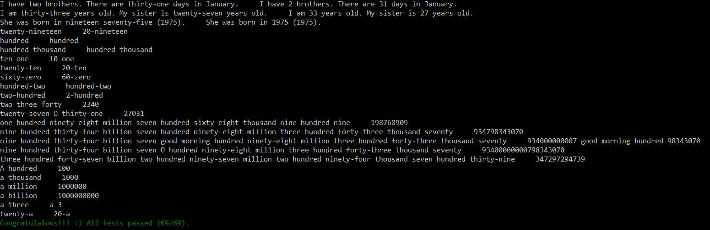
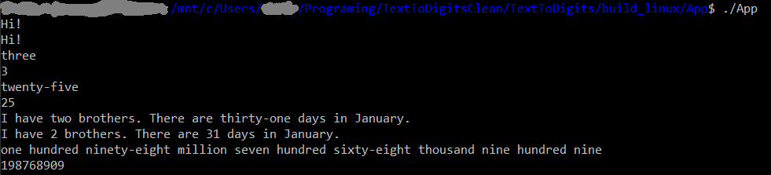

# Text To Digits

## Specification

Executable that converts written numbers in words to digits in the middle of a paragraph.

### Examples

- If the input is "one hundred and one", the output should be "10".
- If the input is "I have one hundred apples" the output should be "I have 100 apples".

### Rules

- Numbers can only be positive integers up to one billion (10^9).
- [English cardinal number notation](https://www.vocabulary.cl/Basic/Numbers.htm) ("," is not used for transcribed digits).
- [English phone number notation](https://www.vocabulary.cl/Basic/Numbers.htm) ("-" is not used for transcribed digits).
- Separator "-" is only allowed in text for numbers from 21 to 99 like "twenty-one".
- Separators combination of " ", ", " and "and" are allowed in text.
- Especial case "A hundred", " A million",... is supported and word "a" is reserved for this case.
- Upper case for first letters of words is supported.

## Folder Structure

- **App** subproject contains the application it self.
- **Test** subproject contains the functional test for the text to digits converter.

## Test

- Text conversion functionality is tested by the *Test* subproject implemented module as UnitTest and run for the platforms described in the next section. You can find all the test inputs and outputs in hardcoded in [Test/main.cpp:testDataSet](Test/main.cpp).

  

- Command line interface functionality is tested manually in all platforms described in the next section due is very simple for now.



## Platforms

### Compliance

- CMake 3.8 or higher.
- C++ 14 Standard Compliant.

### Tested platforms

- Tested on Windows 10 with Visual Studio 16 (2019) and Visual Studio 2019 Tools for CMake 1.0.
- Tested on Windows 10 with Visual Studio 16 (2019) and CMake 3.18.2.
- Tested on Ubuntu 16.04 g++ 5.5.0 and CMake 3.18.2.

## How to build and run

### Linux

#### Build

From {REPO_DIR}:

```bash
mkdir build_linux
cd build_linux
cmake ..
make
```

#### Run Application

From {REPO_DIR}/build_linux:

```bash
cd App
./App
```

#### Run Tests

From {REPO_DIR}/build_linux:

```bash
cd Test
./Test
```

### Windows

#### Build

From {REPO_DIR}:

```bash
mkdir build_windows
cd build_windows
cmake ..
```

Then you will need to open the solution "{REPO_DIR}/build_windows\TextToDigits.sln" using Visual Studio and compile all.

#### Run Application

From {REPO_DIR}/build_windows:

```bash
cd App\Debug
App.exe
```

#### Run Tests

From {REPO_DIR}/build_windows:

```bash
cd Test\Debug
Test.exe
```